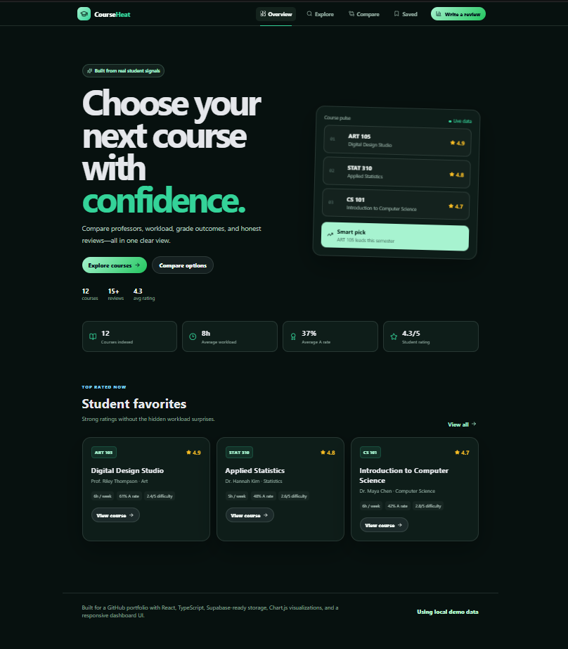
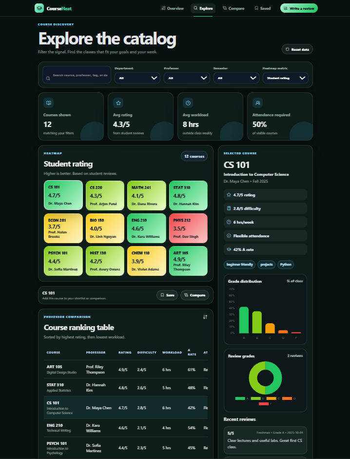
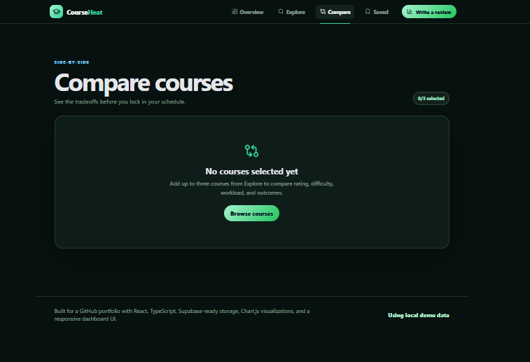
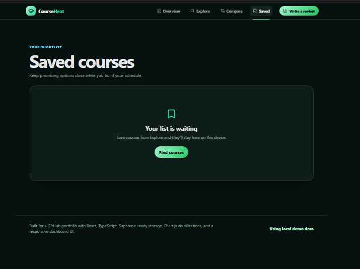
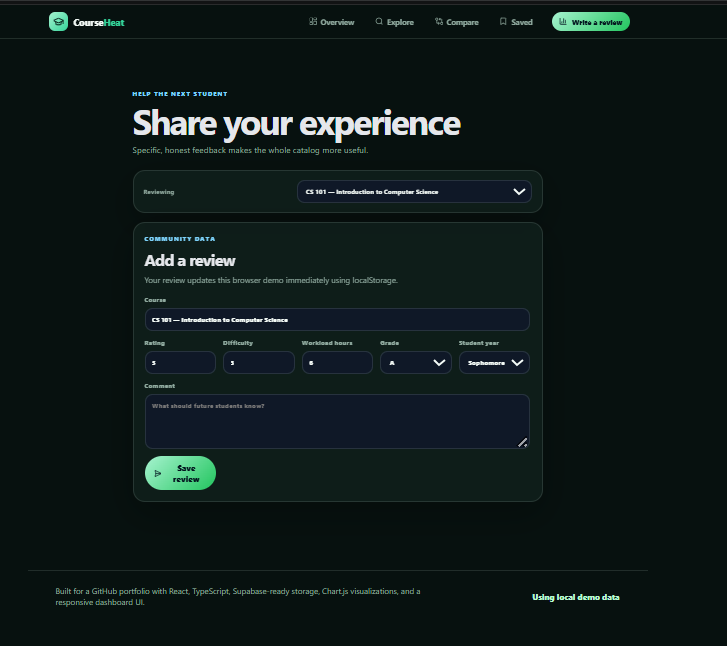

<div align="center">

# 🎓 CourseHeat — Course Review Heatmap

### A modern course-intelligence dashboard for comparing ratings, professors, workload, difficulty, and grade outcomes.

<br />

<a href="https://www.linkedin.com/in/anant-jodha/">
  
</a>

<br />
<br />


<br />
<br />








</div>

---

## 📌 About The Project

**CourseHeat** is a responsive course-review and analytics application that helps students make better registration decisions.

Instead of reading disconnected reviews, students can explore courses through a visual heatmap, compare professors and course outcomes, inspect grade charts, save a shortlist, and submit their own feedback. The included mock catalog makes the project fully usable without a backend, while the Supabase schema provides a path to persistent, multi-user data.

The application is organized into five focused screens:

- **Overview** introduces key catalog signals and top-rated courses.
- **Explore** combines filters, heatmaps, rankings, insights, and course details.
- **Compare** places up to three selected courses side by side.
- **Saved** keeps a persistent personal shortlist.
- **Review** provides a focused course-review form.

---

## ✨ Key Features

| Feature | Description |
|---|---|
| 🗺️ Interactive Heatmap | Visualizes ratings, difficulty, workload, A-rate, or attendance policy |
| 🔎 Smart Search & Filters | Filters by keyword, department, professor, and semester |
| ⚖️ Course Comparison | Compares up to three courses side by side |
| 🔖 Saved Shortlist | Stores favorite courses locally across browser sessions |
| 📊 Grade Visualizations | Displays grade distributions and review-grade charts with Chart.js |
| 🧠 Automatic Insights | Highlights high-rated low-stress options, difficult courses, and strong A-rates |
| 📝 Review Submission | Adds reviews and recalculates visible course metrics immediately |
| 👨‍🏫 Professor Rankings | Sorts courses by rating and workload for quick comparison |
| 💾 Local-First Demo | Works without accounts, API keys, or a backend |
| ☁️ Supabase Ready | Includes a database schema and environment configuration template |
| 📱 Responsive UI | Adapts navigation, dashboards, tables, and details for smaller screens |
| ♿ Accessible Controls | Uses semantic buttons, labels, form validation, and useful ARIA text |

---

## 🛠️ Tech Stack

| Technology | Usage |
|---|---|
| **React 18** | Component-based user interface |
| **TypeScript** | Typed course, review, filter, and metric models |
| **Vite 6** | Development server and production bundler |
| **CSS3** | Responsive layouts, animation, and visual design system |
| **Chart.js** | Bar and doughnut data visualizations |
| **React Chart.js 2** | React bindings for Chart.js |
| **Lucide React** | Interface icons |
| **localStorage** | Persists reviews, saved courses, and comparison selections |
| **Supabase** | Optional hosted PostgreSQL backend |

---

## 📂 Folder Structure

```text
course-review-heatmap/
│
├── public/
│   └── logo.svg
│
├── scripts/
│   └── validate-project.mjs
│
├── src/
│   ├── components/
│   │   ├── CompareScreen.tsx
│   │   ├── CourseDetail.tsx
│   │   ├── CourseTable.tsx
│   │   ├── Filters.tsx
│   │   ├── GradeCharts.tsx
│   │   ├── Header.tsx
│   │   ├── HeatmapGrid.tsx
│   │   ├── InsightsPanel.tsx
│   │   ├── OverviewScreen.tsx
│   │   ├── ReviewForm.tsx
│   │   ├── SavedScreen.tsx
│   │   └── StatCards.tsx
│   ├── data/
│   │   └── mockCourses.ts
│   ├── lib/
│   │   ├── courseUtils.ts
│   │   ├── storage.ts
│   │   └── supabase.ts
│   ├── styles/
│   │   └── index.css
│   ├── App.tsx
│   ├── main.tsx
│   └── types.ts
│
├── supabase/
│   └── schema.sql
├── .env.example
├── package.json
├── tsconfig.json
├── vite.config.ts
└── README.md
```

---

## 🚀 Getting Started

Follow these steps to run CourseHeat locally.

### ✅ Prerequisites

Install **Node.js 20 or newer** and npm.

```bash
node -v
npm -v
```

### 📥 Installation

Clone the repository:

```bash
git clone https://github.com/your-username/course-review-heatmap.git
```

Move into the project folder:

```bash
cd course-review-heatmap
```

Install dependencies:

```bash
npm install
```

### ▶️ Run The Project

Start the development server:

```bash
npm run dev
```

Open the URL displayed in the terminal, normally:

```text
http://localhost:5173
```

---

## 🧪 Test The Main User Flow

1. Open **Explore** from the navigation.
2. Search for a course or filter by department and professor.
3. Change the heatmap metric to workload, difficulty, or A-rate.
4. Select a course and choose **Save** or **Compare**.
5. Add two more courses and open the **Compare** screen.
6. Open **Review**, select a course, and submit a review.
7. Refresh the page to confirm that local changes remain available.

---

## 📸 Project Preview

Add a current screenshot after running the project:

```md

```

Place `preview.png` in the project root and GitHub will display it in the README.

---

## ⚙️ Available Scripts

| Command | Description |
|---|---|
| `npm install` | Installs project dependencies |
| `npm run dev` | Starts the Vite development server |
| `npm run build` | Type-checks and creates the production build |
| `npm run preview` | Serves the production build locally |
| `npm run validate` | Checks required files, source structure, and course data |

---

## 🧭 Application Flow

```text
Overview
   └── Explore course catalog
          ├── Select course → View details and charts
          ├── Save course → Saved shortlist
          ├── Add to compare → Compare screen
          └── Write review → Review screen → Updated metrics
```

---

## 📊 Supported Heatmap Metrics

| Metric | Meaning |
|---|---|
| **Student Rating** | Average review rating out of five |
| **Difficulty** | Student-reported course difficulty out of five |
| **Weekly Workload** | Estimated study hours outside class |
| **A Grade Rate** | Percentage of students receiving an A |
| **Attendance Required** | Whether attendance is mandatory or flexible |

---

## 💾 Local Data Storage

CourseHeat works without a database by storing demo changes in the browser.

The following data persists with `localStorage`:

- Added course reviews
- Updated rating, difficulty, workload, and grade metrics
- Saved course IDs
- Comparison course IDs

Use **Reset data** on the Explore screen to restore the original demo catalog.

> Browser storage is device-specific. It is designed for the portfolio demo and is not shared between users.

---

## ☁️ Optional Supabase Setup

The repository includes a Supabase-ready schema for upgrading the local demo to a real application.

1. Create a project at [Supabase](https://supabase.com/).
2. Open the Supabase SQL Editor.
3. Run the contents of `supabase/schema.sql`.
4. Copy `.env.example` to `.env`.
5. Add your project credentials:

```env
VITE_SUPABASE_URL=your_supabase_project_url
VITE_SUPABASE_ANON_KEY=your_supabase_anon_key
```

6. Restart the development server.

The current interface remains local-first. Connect the data functions in `src/lib/` to Supabase when implementing shared reads and writes.

---

## 🧠 Core Application Logic

The utilities in `src/lib/courseUtils.ts` handle:

- Searching and filtering the catalog
- Formatting selected heatmap metrics
- Assigning heatmap color classes
- Calculating dashboard statistics
- Calculating course A-rates
- Adding reviews and recomputing averages
- Updating grade-distribution percentages

Example filter usage:

```ts
const filteredCourses = filterCourses(courses, filters);
```

Example review update:

```ts
const updatedCourse = addReviewToCourse(course, form);
```

---

## 🎨 Frontend Highlights

The frontend includes:

- Sticky desktop navigation and a compact mobile menu
- Responsive dashboard and course-detail layouts
- Interactive course heat tiles
- Reusable cards, pills, tags, and empty states
- Bar and doughnut charts
- Form feedback and validation
- Subtle transitions between screens
- A dark emerald visual system designed for data readability

---

## 🔒 Data & Security Notes

The demo includes basic client-side safeguards:

- Review comments require a minimum useful length.
- Numeric review inputs have defined minimum and maximum values.
- React safely escapes rendered review text by default.
- Supabase credentials are loaded from environment variables.
- `.env` files should never be committed to Git.

For production, add authentication, server-side validation, moderation, and Supabase Row Level Security policies.

---

## 🎯 Future Improvements

- 🔐 Verified student authentication
- 🛡️ Review moderation and reporting
- 🏫 University and department-specific pages
- 📥 CSV import for official grade datasets
- 📅 Visual schedule builder with time-conflict detection
- 🔔 Course availability and registration alerts
- 🌗 Dark and light theme toggle
- 🔗 Shareable comparison links
- 📈 Historical semester trends
- ♿ Automated accessibility testing
- 🧪 Component and end-to-end test suites
- 🚀 Live deployment with persistent Supabase data

---

## 🌍 Deployment Ideas

| Platform | Purpose |
|---|---|
| **Vercel** | Deploy the Vite frontend |
| **Netlify** | Static hosting and preview deployments |
| **Cloudflare Pages** | Global static frontend hosting |
| **Supabase** | PostgreSQL database and authentication |
| **GitHub Actions** | Automated validation and production builds |

Before deployment, run:

```bash
npm run validate
npm run build
```

Upload the generated `dist/` directory or connect the GitHub repository directly to the hosting platform.

---

## 🧩 Common Errors And Fixes

### Port 5173 is already in use

Start Vite on another port:

```bash
npm run dev -- --port 5174
```

### Node or npm is not recognized

Install Node.js, close and reopen the terminal, then check:

```bash
node -v
npm -v
```

### Dependencies fail to install on Windows

Read `INSTALL_FIX_WINDOWS.md`, remove an incomplete `node_modules` folder if present, and run:

```bash
npm install
```

### Supabase shows as disconnected

Confirm that `.env` exists in the project root, both variables begin with `VITE_`, and the development server was restarted after editing the file.

### Saved data looks outdated

Use **Reset data** on the Explore screen or clear the site data for `localhost` in the browser.

---

## 🤝 Connect With Me

<div align="center">

### 👨‍💻 Anant Jodha

<a href="https://www.linkedin.com/in/anant-jodha/">
  
</a>

</div>

---

## 📄 License

This project is open-source and available under the **MIT License**.

---

<div align="center">

## ⭐ Show Your Support

If CourseHeat helped or inspired you, give the repository a ⭐ on GitHub.

<br />


</div>
